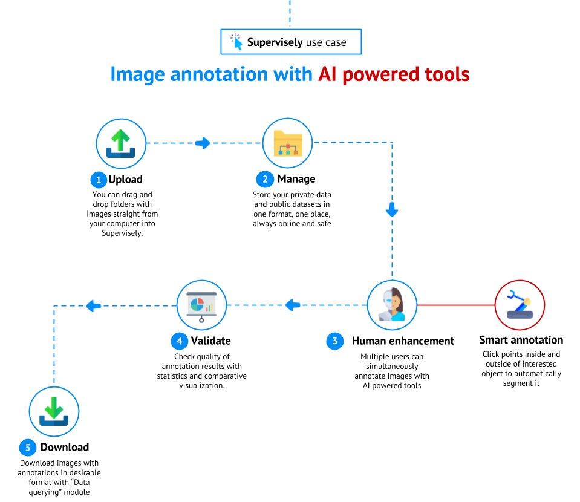
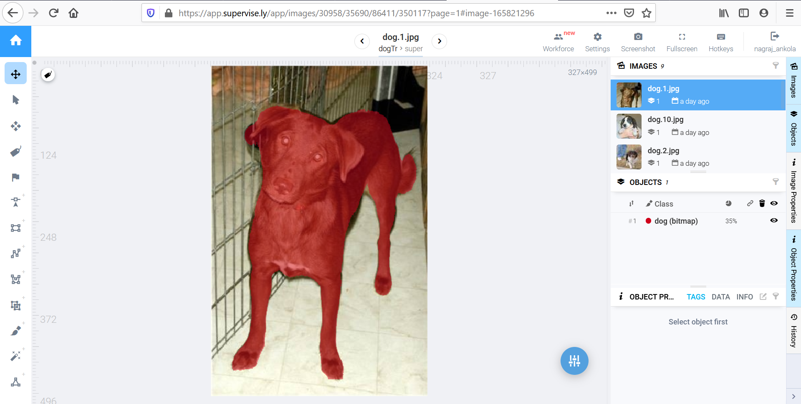
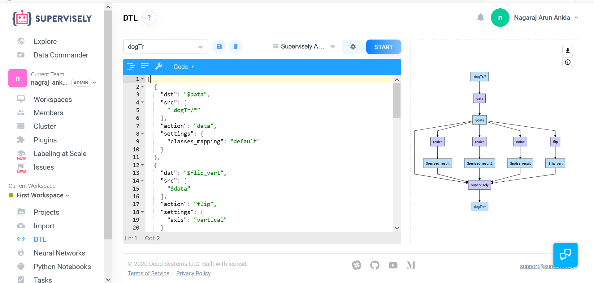
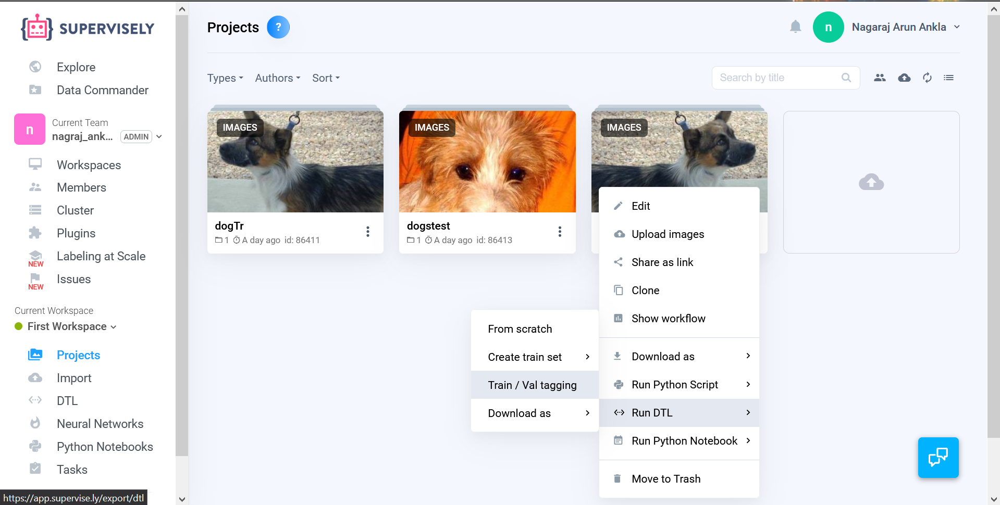
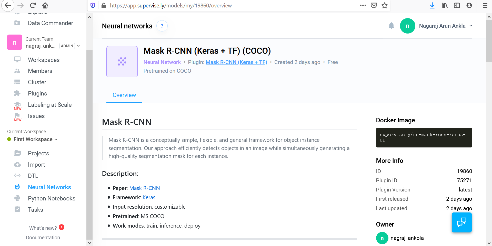
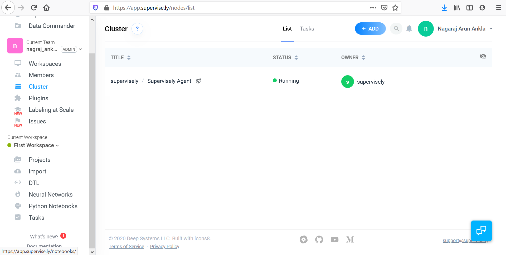
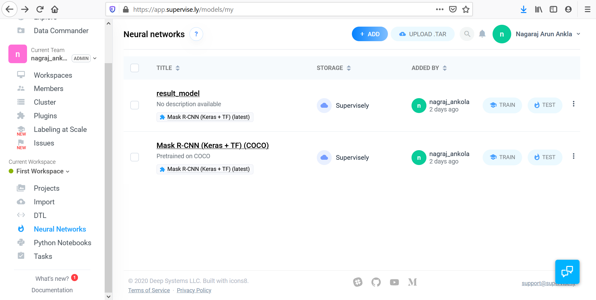
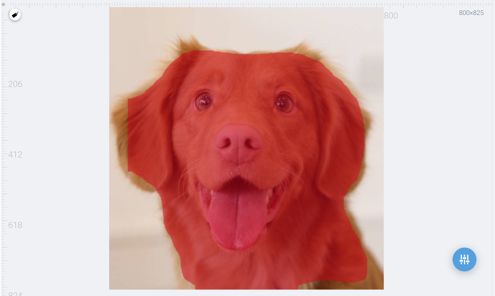

# ***Detection of Objects Using Mask R-CNN and Supervisely***

## Mask rcnn:
#### Mask RCNN is used when you have multiple objects belonging to the same category/class. Each object is called the ‘instance’ of the class. Now if multiple instances of the same class are overlapping, then it is essential to classify the pixels’ membership to only a particular instance. 
#### If you are familiar with Faster R-CNN, it could only detect bounding boxes around objects but wherein Mask R-CNN, you can segment out the object from the rest of the image. It means the pixels of the object will be assigned a particular colour and all the background pixels will be the same (or we can also assign to a different colour).

## What is Supervisely?
#### Supervisely is a web platform where you can find everything you need to build Deep Learning solutions within a single environment.

#### Supervisely allows its users to make and prepare training data for various number of computer vision tasks like object detection, segmmentation etc. In a simple words, we know that more is the training data the smarter is the AI. Thus Supervisely is one of the tools to perform image annotation as efficient as possible.

## Supervisely Workflow

### Step 1: 
#### Import your dataset, we can use any number of images here depending upon our usecase(i've used 15images). Name the folder and now we have to manually annotate or we can let supervisely do it for us i.e by using the tools provided by supervisely.

### Step2: Data Augmentation
#### To increase variaility of the training data and make the learned models more robust, a common approach is to perform augmentations. Augmentations are image transformations that preserve the essential appearance of the objects, like random crops or rotations. The transformed data is then used as training data for the model. In Supervisely, one way to conveniently augment your data is to run a Data Transformation Language plugin with a set of predefined transformtations. The output of the plugin forms a new project, which we will then use for training the model.

### Step 3: 
#### Select any of the pre-trained model along with their weights and add the to your work space. (I have used Mask R-CNN) 

### Step 4:
#### Now we have our final dataset and in order to train our model we need to provide the proper resources. 

### Step 5: 
#### Click on the model which you have cloned and provide the manually annotated dataset for the training. Once after your model is trained you are ready to use it.

## Test Results:

